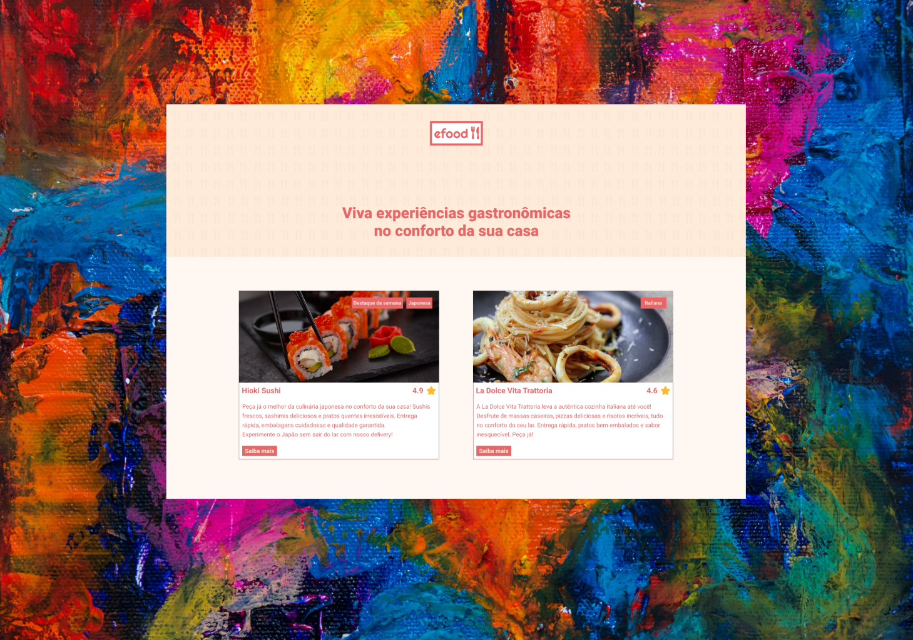

# eFood



## Table of contents
- [eFood](#efood)
  - [Table of contents](#table-of-contents)
  - [Layout and API links:](#layout-and-api-links)
  - [Vite-template-redux](#vite-template-redux)
    - [Goals](#goals)
    - [Scripts](#scripts)
    - [Inspiration](#inspiration)

The eFood project is a React-based online food ordering platform that utilizes Styled Components for styling, React Router for seamless navigation and Redux ToolKit for state management. Divided into four parts, the project encompasses the following:

Foundation Setup: Creation of a new React project based on the provided layout, with styling using Styled Components and page navigation facilitated by React Router. The project is hosted on Vercel for accessibility.

Modal Creation and API Integration: Implementation of a purchase modal triggered by user actions, with content dynamically populated via AJAX requests using the Restaurants API. Project updates are pushed to the repository and deployed for review.

Shopping Cart Development: Development of a shopping cart page integrated with Redux for state management. The cart calculates total purchase values dynamically based on selected products. Project changes are pushed to the repository and deployed on Vercel.

Order Processing and Confirmation: Creation of an order delivery page with functionality to process orders. Upon completion, a confirmation screen displays order details fetched from the Checkout API's response. Project updates are pushed to the repository and deployed for evaluation.

The eFood project aims to deliver a user-friendly online food ordering experience through a comprehensive development approach, from foundational setup to advanced feature implementation.


## Layout and API links:

- Online Project: <a href="https://efood-arthurferreira.vercel.app/" target="_blank">Vercel (Online)</a>
  
- Project Layout: <a href="https://www.figma.com/file/JjduV2Tg713TzYUUsees8b/efood?type=design&node-id=0-1&mode=design&t=rYQDbb63ByBzXf3r-0" target="_blank">eFood</a>

- Restaurants API: <a href="https://fake-api-tau.vercel.app/api/efood/restaurantes" target="_blank">Restaurantes</a>

- Checkout API: <a href="https://fake-api-tau.vercel.app/api/efood/checkout" target="_blank">Checkout</a>


## Vite-template-redux

Uses [Vite](https://vitejs.dev/), [Vitest](https://vitest.dev/), and [React Testing Library](https://github.com/testing-library/react-testing-library) to create a modern [React](https://react.dev/) app compatible with [Create React App](https://create-react-app.dev/)

```sh
npx degit reduxjs/redux-templates/packages/vite-template-redux my-app
```

### Goals

- Easy migration from Create React App or Vite
- As beginner friendly as Create React App
- Optimized performance compared to Create React App
- Customizable without ejecting

### Scripts

- `dev`/`start` - start dev server and open browser
- `build` - build for production
- `preview` - locally preview production build
- `test` - launch test runner

### Inspiration

- [Create React App](https://github.com/facebook/create-react-app/tree/main/packages/cra-template)
- [Vite](https://github.com/vitejs/vite/tree/main/packages/create-vite/template-react)
- [Vitest](https://github.com/vitest-dev/vitest/tree/main/examples/react-testing-lib)
